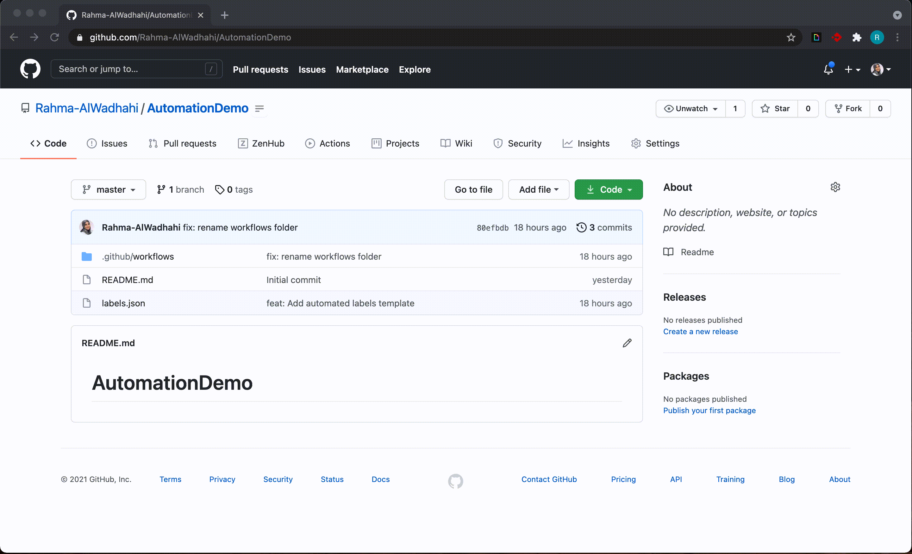

# AutomationDemo

This repository is used for the demonstration of how GitHub Automation works.

### To follow same steps:

1. Create a YAML file in the directory `.github/workflows/<newfile-name.yml>`
1. Take the code in `labels.yml` file.
1. Create a JSON file in the main directory. This file will have the labels specification that you want to apply to the repository.
1. Commit and push your changes to GitHub.

Now that your workflow is in Github, go to the Actions tab of your repository. Choose the Action name on the left side, and Choose to run workflow as shown in the screenshot below.

### References

- Followed this video with slight modification to `labels.yml` file : [Sync GitHub Issue Labels with a JSON File and a GitHub Action](https://www.youtube.com/watch?v=HTFf0P2DlvQ)
- Using Open Sourced [GitHub Labels Template](https://github.com/xavierchow/github-label-template)
